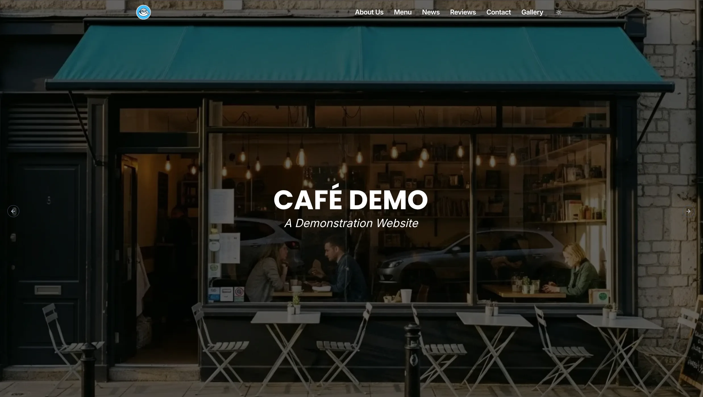

# Cafe Demo Site

This project is a demo website built using **Next.js 15** and **Sanity CMS**, styled with **Tailwind CSS**. It serves as a modern, content-driven web application foundation.

## Tech Stack

- **Framework**: [Next.js 15](https://nextjs.org/) (App Router)
- **CMS**: [Sanity.io](https://www.sanity.io/) (Headless CMS)
- **Styling**: [Tailwind CSS](https://tailwindcss.com/)
- **UI Components**: [Shadcn UI](https://ui.shadcn.com/) / [Sanity UI](https://www.sanity.io/ui)

## Getting Started

### 1. Install Dependencies

```bash
npm install
# or
pnpm install
```

### 2. Environment Setup

Copy the example environment file and fill in your Sanity credentials:

```bash
cp .env.local.example .env.local
```

You will need:

- `NEXT_PUBLIC_SANITY_PROJECT_ID`
- `NEXT_PUBLIC_SANITY_DATASET`

### 3. Run Development Server

```bash
npm run dev
```

Open [http://localhost:3000](http://localhost:3000) to view the site.
Open [http://localhost:3000/studio](http://localhost:3000/studio) to access the Sanity Content Studio.

## Scripts

- `npm run dev`: Start development server
- `npm run build`: Build for production
- `npm run typegen`: Generate TypeScript types from Sanity schema

## Deploy

This project is ready to be deployed on [Vercel](https://vercel.com/). Connect your repository and ensure the environment variables are set in the Vercel dashboard.
